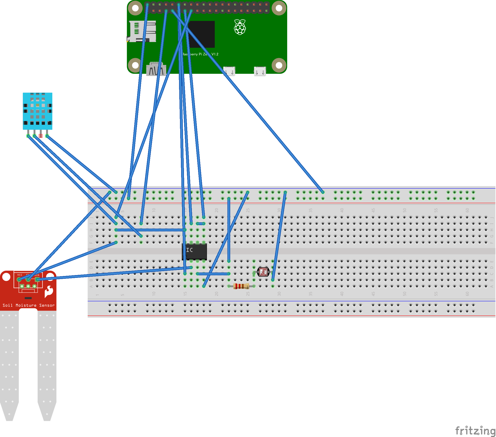

# raspi_plant_checker


> Houseplant management system using Raspberry PI

## Background

I grow a banyan tree at home, but I forgot to water it and almost died.

To prevent such a mistake, I have created a module that automatically measures the timing of watering.

## Setup

### Prepare

Buy in advance below.

- Raspberry PI (model 2B+/3/4/Zero WH)
- Soil humidity sensor (YL-69)
- Temperature and humidity sensor (DHT11)
- Photoresistor
- A/D converter (ADC0832)

### Setup Python3 for Raspberry PI

```
sudo apt-get update
sudo apt-get install build-essential python3-dev
```

### Setup ADC0832

```
curl https://raw.githubusercontent.com/sunfounder/Sunfounder_SensorKit_Python_code_for_RaspberryPi/master/ADC0832.py
```

### Setup DHT11

```
git clone https://github.com/adafruit/Adafruit_Python_DHT.git
cd Adafruit_Python_DHT
sudo python3 setup.py install
```

### Setup Dependencies

```
pip3 install -r requirements.txt
```

### Setup for sensors



## Usage

Enter command below, run API server.

```
python3 main.py
```
