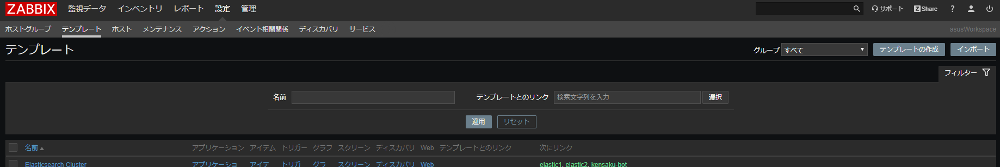

# raspi_plant_checker


> Houseplant management system using Raspberry PI

## Background

I grow a banyan tree at home, but I forgot to water it and almost died.

To prevent such a mistake, I have created a module that automatically measures the timing of watering.

## Setup

### Prepare

Buy in advance below.

- Raspberry PI (model 2B+/3/4/Zero WH)
- Soil humidity sensor (YL-69)
- Temperature and humidity sensor (DHT11)
- Photoresistor
- A/D converter (ADC0832)

### Setup Python3 for Raspberry PI

```
sudo apt-get update
sudo apt-get install build-essential python3-dev
```

### Setup ADC0832

```
curl https://raw.githubusercontent.com/sunfounder/Sunfounder_SensorKit_Python_code_for_RaspberryPi/master/ADC0832.py
```

### Setup DHT11

```
git clone https://github.com/adafruit/Adafruit_Python_DHT.git
cd Adafruit_Python_DHT
sudo python3 setup.py install
```

### Setup Dependencies

```
pip3 install -r requirements.txt
```

### Setup for sensors

- A/D
  - CS: Pin 11
  - CLK: Pin 12
  - DI/DO: Pin 13
  - VCC: Pin 15
  - GND: GND
- YL-69
  - VCC: Pin15
    - When power is applied constantly, electrolysis will occur and the sensor will rust.(not use 5v/3.3v)
  - Data: A/D(CH0)
  - GND: GND
- DHT11
  - VCC: 5v or Pin15
  - Data: Pin7
  - GND: GND
- Photoresistor
  - VCC: 5v
  - Data: A/D(CH1) with 10kΩ Resist
  - GND: GND


## Usage

Enter command below, run API server.

```
python3 main.py
```

### API Reference

#### Get temperature

```
- GET /temperature
```

Response

```
{
    "key": "temperature",
    "value": 20.2
}
```

#### Get humidity

```
- GET /humidity
```

Response

```
{
    "key": "humidity",
    "value": 60.5
}
```

#### Get light

```
- GET /light
```

Response

```
{
    "key": "light",
    "value": 175
}
```

#### Get moisture

```
- GET /moisture
```

Response

```
{
    "key": "moisture",
    "value": 0
}
```

### Use with Zabbix

If you use Zabbix, you can collect metrics for external scripts.

- First, set `collect_zabbix.sh` to Zabbix's external scripts.

```
git clone https://github.com/tubone24/raspi_plant_checker.git
cp raspi_plant_checker/src/collect_zabbix.sh /usr/lib/xabbix/externalscripts/
chmod +x /usr/lib/xabbix/externalscripts/collect_zabbix.sh
```

- Load Temprate `zbx_export_templates_plant_checker.xml`



## Demo

Setup my Raspberry PI and check my banyan!


